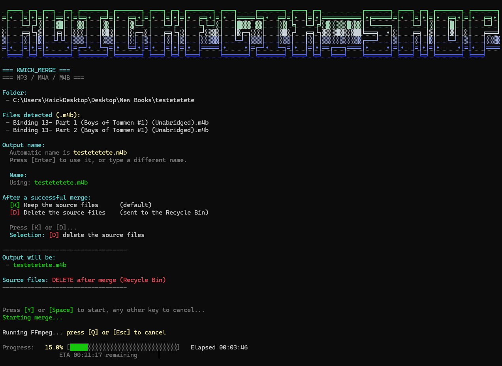

<p align="center">
  
</p>

# Kwick_Merge — Drag a Folder, Get One Audiobook

Multi-part audiobooks are a mess. You buy a book and get
`Part 1.m4b`, `Part 2.m4b`, `Part 3.m4b` — three separate entries in your
library, three separate bookmarks, three chances to lose your place.
Kwick_Merge fixes that in about ten seconds of your attention: **drag the
folder onto the launcher, answer two questions, walk away.**

It is a single PowerShell script wrapped around FFmpeg. No install, no
dependencies to manage, no Python, no Node, nothing in your registry, nothing
running in the background. One file that does one job and gets out of the way.

> Built because every "audiobook merger" is either a 200 MB Electron app, a
> web uploader that wants your 700 MB file, or a wall of FFmpeg flags you have
> to look up every single time.

<div align="center">

[](https://github.com/Kwickflix/kwick-merge/releases/latest)
[](#requirements)
[](#requirements)
[](#requirements)
[](#supported-formats)

[](https://discord.gg/ruGAfxUmZ3)
[](https://t.me/+8ifZv6x0sgAzOWE5)
[](https://www.facebook.com/profile.php?id=61590978926218)
[](https://kwickflix.shop/)

**Drag folder → name it → keep or delete the parts → done.**

*No install. No upload. Your files never leave your machine.*

</div>

<p align="center">
  
</p>

---

## Table of Contents

1. [What it does](#what-it-does)
2. [Why it exists](#why-it-exists)
3. [Requirements](#requirements)
4. [Install — 2 steps](#install--2-steps)
5. [How to use it](#how-to-use-it)
6. [What you'll see](#what-youll-see)
7. [The two questions it asks](#the-two-questions-it-asks)
8. [Your files are safe — here's exactly why](#your-files-are-safe--heres-exactly-why)
9. [Supported formats](#supported-formats)
10. [How long does it take?](#how-long-does-it-take)
11. [How it works under the hood](#how-it-works-under-the-hood)
12. [Troubleshooting](#troubleshooting)
13. [FAQ](#faq)
14. [Changelog](#changelog)

---

## What it does

Point it at a folder of audio files and it produces **one merged file** in the
same folder, in the same format, with the parts joined end to end in the right
order.

- **Drag and drop** — drop a folder on `kwick-merge.cmd`. That's the interface.
- **Finds the files itself** — every `.mp3`, `.m4a` and `.m4b` in the folder.
- **Orders them like a human would** — natural sort, so `Part 2` comes before
  `Part 10`. Plain alphabetical sorting gets this wrong, and a book merged in the
  wrong order is worse than no merge at all.
- **Names the output for you** — defaults to the folder name, or type your own.
- **Keeps or bins the parts** — your choice, and only ever *after* a successful merge.
- **Live progress** — percentage, a real progress bar, elapsed time and an ETA.
- **Cancel any time** — press `Q` and it stops cleanly, leaving everything as it was.
- **Writes a log** if anything goes wrong, right next to the output.

---

## Why it exists

Merging audio with FFmpeg by hand looks like this:

```
ffmpeg -i "Part 1.m4b" -i "Part 2.m4b" -filter_complex "[0:a][1:a]concat=n=2:v=0:a=1[aout]" -map "[aout]" -c:a aac -b:a 96k "Book.m4b"
```

That's fine once. It is not fine for the fortieth book, and it gets worse the
moment you have nine parts, filenames with apostrophes, or a folder name with
brackets in it. Every character has to be right, and there is no progress bar,
no ETA, and no undo.

Kwick_Merge is that command with the sharp edges filed off:

| Doing it by hand | Kwick_Merge |
|---|---|
| Type every input path exactly | Finds them all itself |
| `Part 10` sorts before `Part 2` | Natural sort, correct every time |
| Pick the codec and bitrate | Matches your source format automatically |
| A wall of scrolling FFmpeg output | One clean progress bar with an ETA |
| No way to stop without losing the file | `Q` cancels cleanly |
| A failed run leaves a broken half-file | Failures leave your folder untouched |
| Delete the parts and hope | Parts go to the Recycle Bin, after success only |

---

## Requirements

| Thing | Version | Notes |
|---|---|---|
| **Windows** | 10 or 11 | Uses the Recycle Bin and Windows Terminal niceties |
| **PowerShell** | 5.1+ | Ships with Windows. Nothing to install |
| **FFmpeg** | any recent build | Must include `ffmpeg` **and** `ffprobe` |
| **Windows Terminal** | optional | Gives you the colour gradient and clickable banner |

FFmpeg has to be on your `PATH`. Check it:

```powershell
ffmpeg -version
ffprobe -version
```

If those print version info, you're ready. If you get "not recognized", install
FFmpeg first — [gyan.dev builds](https://www.gyan.dev/ffmpeg/builds/) are the
usual choice on Windows — and make sure its `bin` folder is on your `PATH`.

---

## Install — 2 steps

1. Download `kwick-merge.ps1` and `kwick-merge.cmd`. Put them **in the same
   folder**, anywhere you like (`C:\Tools` is a good home).
2. Right-click `kwick-merge.cmd` → **Send to** → **Desktop (create shortcut)**.

That's it. There's no installer and nothing is written outside that folder.

> **Optional:** give the shortcut a nicer icon and name. The script sets the
> window title to `Kwick_Merge` on its own.

### Why a `.cmd` and a `.ps1`?

The `.cmd` is just a doorway. Windows won't let you drag a folder onto a
PowerShell script directly, so the launcher takes the drop, opens a window wide
enough for the banner (150 columns), and hands the folder to the script. The
`.ps1` does all the real work.

---

## How to use it

**Drag a folder onto the shortcut.** Not the files — the *folder* they're in.

```
📁 Binding 13 (Boys of Tommen #1)
   ├── Binding 13 - Part 1.m4b     ─┐
   ├── Binding 13 - Part 2.m4b      ├─  drag this folder onto kwick-merge.cmd
   └── Binding 13 - Part 3.m4b     ─┘

                 ↓

📁 Binding 13 (Boys of Tommen #1)
   └── Binding 13 (Boys of Tommen #1).m4b     one file, parts in order
```

The script shows you what it found, asks two questions, then waits for you to
press `Y` before touching anything.

---

## What you'll see


The whole run, start to finish:

```
=== KWICK_MERGE ===
=== MP3 / M4A / M4B ===

Folder:
 - D:\Audiobooks\Binding 13 (Boys of Tommen #1)

Files detected (.m4b):
 - Binding 13 - Part 1.m4b
 - Binding 13 - Part 2.m4b

Output name:
  Automatic name is Binding 13 (Boys of Tommen #1).m4b
  Press [Enter] to use it, or type a different name.

  Name:
  Using: Binding 13 (Boys of Tommen #1).m4b

After a successful merge:
  [K] Keep the source files      (default)
  [D] Delete the source files    (sent to the Recycle Bin)

  Press [K] or [D]...
  Selection: [D] delete the source files

-----------------------------------
Output will be:
 - Binding 13 (Boys of Tommen #1).m4b

Source files: DELETE after merge (Recycle Bin)
-----------------------------------

Press [Y] or [Space] to start, any other key to cancel...
Starting merge...

Running FFmpeg... press [Q] or [Esc] to cancel

Progress:   15.0% [████░░░░░░░░░░░░░░░░░░░░░░]   Elapsed 00:03:46
                ETA 00:21:17 remaining
```

---

## The two questions it asks

### 1. Output name

Defaults to the folder's name, which is usually exactly what you want — you
named the folder after the book. Press `Enter` to take it, or type something
else. You don't need to type the extension; it's added for you, and typing one
anyway is harmless.

Illegal Windows characters (`< > : " / \ | ? *`) are stripped automatically, and
the script tells you if it had to clean up what you typed.

### 2. Keep or delete the parts

- **`K` — keep** (the default, and what `Enter` does). Nothing is removed.
- **`D` — delete**. After a *successful* merge, the parts go to the **Recycle
  Bin** — not a permanent delete. If the merge fails or you cancel, nothing is
  removed no matter what you picked.

---

## Your files are safe — here's exactly why

This is the part that matters, so it's worth being specific. A merge tool that
eats your only copy of a book is worse than useless.

**1. It never writes over your files while working.**
The merge goes to a temp file (`YourBook.merging.m4b`). Only once FFmpeg exits
cleanly is that renamed into place. A crash, a power cut or a cancel leaves your
originals exactly as they were.

**2. Deleting is opt-in, and it goes to the Recycle Bin.**
Even when you choose `D`, the parts are *recycled*, not destroyed. Wrong call?
Restore them. If the Recycle Bin isn't available (a network drive, say), the
script says so plainly rather than pretending.

**3. Nothing is deleted unless the merge actually worked.**
The delete step only runs after FFmpeg returns success *and* the file has been
renamed into place. Any failure skips it entirely.

**4. A part can share the output's name without vanishing.**
If your folder is `Part 1` and contains `Part 1.m4b`, the automatic output name
collides with a source file. Because the merge writes to a temp file, that part
is still used as an input, and the old file is only recycled and replaced once
the new one exists. The script warns you before it starts.

**5. Cancelling is clean.**
`Q` or `Esc` kills FFmpeg, deletes the half-finished temp file, and leaves your
folder as it was.

**6. When something breaks, you get a log.**
A `.merge-log.txt` lands next to the output with FFmpeg's own words in it,
rather than a shrug.

---

## Supported formats

| Input | Output | Codec used |
|---|---|---|
| `.mp3` | `.mp3` | `libmp3lame -q:a 2` (V2 VBR, ~190 kbps) |
| `.m4a` | `.m4a` | `aac -b:a 96k` |
| `.m4b` | `.m4b` | `aac -b:a 96k` |

The output format always matches the input. **All files in the folder must be
the same type** — a folder mixing `.mp3` and `.m4b` is refused rather than
silently guessed at, because the right answer there is your call, not the
script's.

> **Note:** files are re-encoded, not stream-copied. That's what makes a pile of
> parts with mismatched bitrates or sample rates join into one file that plays
> cleanly the whole way through. 96 kbps AAC is transparent for spoken word.

---

## How long does it take?

Roughly **60× realtime** on a normal desktop — an hour of audio takes about a
minute.

| Book length | Rough time |
|---|---|
| 8 hours | ~8 minutes |
| 16 hours | ~16 minutes |
| 26 hours | ~25 minutes |

The ETA in the window is measured from actual throughput, so trust it over this
table. It reads high for the first second or two, then settles.

---

## How it works under the hood

For the curious, and for anyone who wants to check the sharp bits themselves:

- **Discovery** — `Get-ChildItem` filtered to the three extensions, skipping any
  leftover `.merging` temp file.
- **Filename hygiene** — files with illegal characters are renamed *before*
  anything else, so FFmpeg never chokes on them mid-run.
- **Natural sort** — numbers in filenames are zero-padded to 10 digits before
  sorting, so `Part 2` lands before `Part 10`.
- **Duration** — `ffprobe` totals every input up front. That total is what makes
  a real percentage and ETA possible.
- **The merge** — one FFmpeg call with each file as its own `-i` input, joined
  by the `concat` filter. No concat demuxer, no list file, no temp playlist.
- **Progress** — `-progress pipe:1` streams machine-readable progress; the
  script reads `out_time_ms` and divides by the total.
- **Non-blocking reads** — output is read with a 200 ms timeout so the cancel key
  is always responsive, and the error pipe is drained in the background so a
  chatty FFmpeg can't deadlock it.
- **Cancel** — the key check accepts key-up events too. `ReadKey` with only
  `IncludeKeyDown` *blocks* when a stray key-up is pending, which will freeze the
  whole thing solid. (Ask how we know.)
- **The swap** — temp file renamed into place, old file recycled first if the
  name is taken.

---

## Troubleshooting

**"Need at least 2 audio files"**
The folder has fewer than two files of one type. Check you dropped the folder
itself, not a file inside it — though if you do drop a file, the script is
polite enough to use its parent folder.

**"Mixed file types detected"**
The folder has more than one of `.mp3` / `.m4a` / `.m4b`. Move the odd ones out
and try again.

**"ffmpeg is not recognized"**
FFmpeg isn't on your `PATH`. See [Requirements](#requirements).

**The banner looks like `ΓûêΓûê` gibberish**
`kwick-merge.ps1` has been re-saved without its UTF-8 BOM. Save it as **UTF-8
with BOM** and the block characters come back.

**The logo is small / the window is narrow**
The full banner needs 140 columns. Below that the script automatically uses a
compact logo instead of letting it wrap. Widen the window to see the big one.

**Progress sits at 0%**
Fixed in 1.0.0 — but if you ever see it, the `.merge-log.txt` next to your
output has FFmpeg's own account of what happened.

---

## FAQ

**Does it upload my files anywhere?**
No. Everything happens on your machine. The banner links to a website; the audio
never goes near it.

**Will it keep chapters?**
No. Chapter markers and cover art are not carried across in this version. The
audio is joined; the metadata isn't. It's on the list.

**Can I merge more than two files?**
Yes, as many as you like. Two is just the minimum.

**Does it work on non-audiobook audio?**
Sure — it's a folder of audio files as far as the script is concerned. Live sets,
lectures, podcast backlogs, all fine.

**Why does it re-encode instead of stream copy?**
Because parts with different bitrates or sample rates won't stream-copy into a
file that plays properly all the way through. Re-encoding is slower but it
always works.

**Can I use it in a script / unattended?**
Not yet — it's built around the prompts. A `-Silent` switch is a reasonable ask.

---

## Changelog

See [CHANGELOG.md](CHANGELOG.md) for the full history.

---

<div align="center">

**Made by [KwickFlix](https://kwickflix.shop/)**

[](https://kwickflix.shop/)
[](https://discord.gg/ruGAfxUmZ3)

</div>
